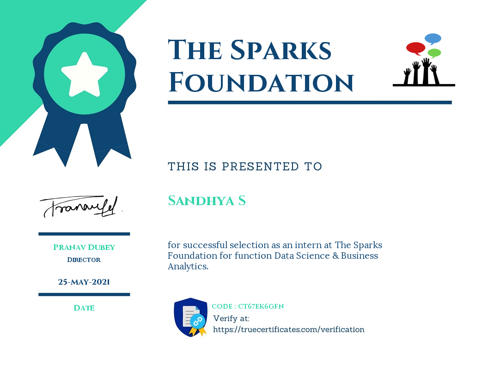
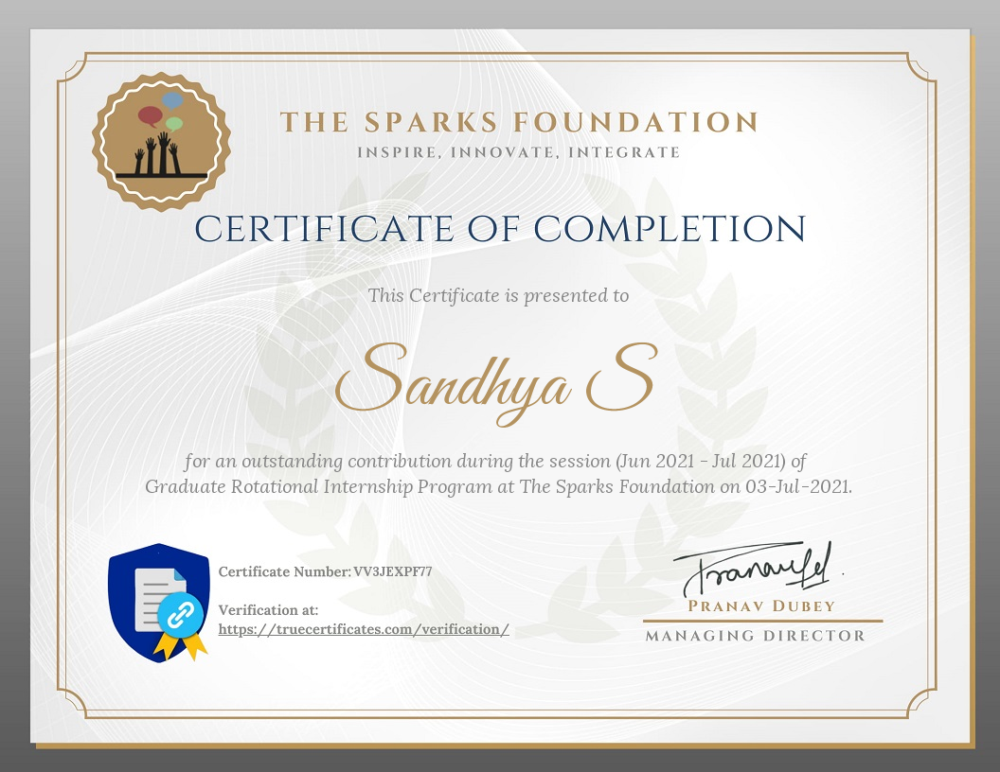

## _Data Science &amp; Business Analytics Internship @TSF-GRIP June '21_
|                          | _Task_  | _Date_ | 
:------------------------  | :------ |:-------------------------  
| _#1_  | _[Prediction using Supervised ML](TASK%20%231/Task1%20Description.md)_ | _07 June_ |
| _#2_  | _[Prediction using Unsupervised ML](TASK%20%232/Task2%20Description.md)_ | _08 June_ |
| _#3_  | _[Exploratory Data Analysis - Retail](TASK%20%233/Task3%20Description.md)_ | _14 June_ |
| _#6_  | _[Prediction using Decision Tree Algorithm](TASK%20%236/Task6%20Description.md)_ | _10 June_ |
---
Selection Certificate      |  Completion Certificate
:-------------------------:|:-------------------------:
  |  
---
